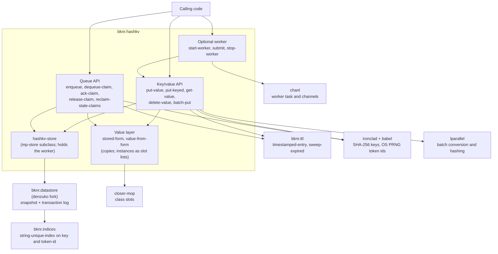
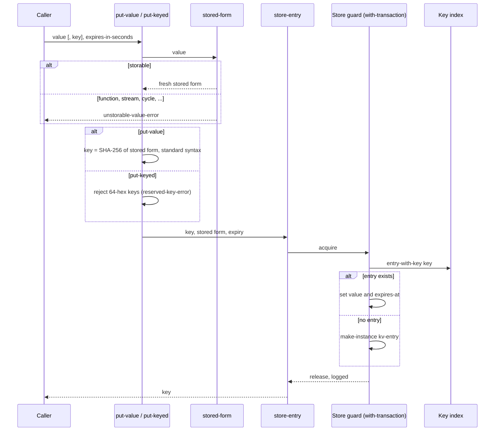
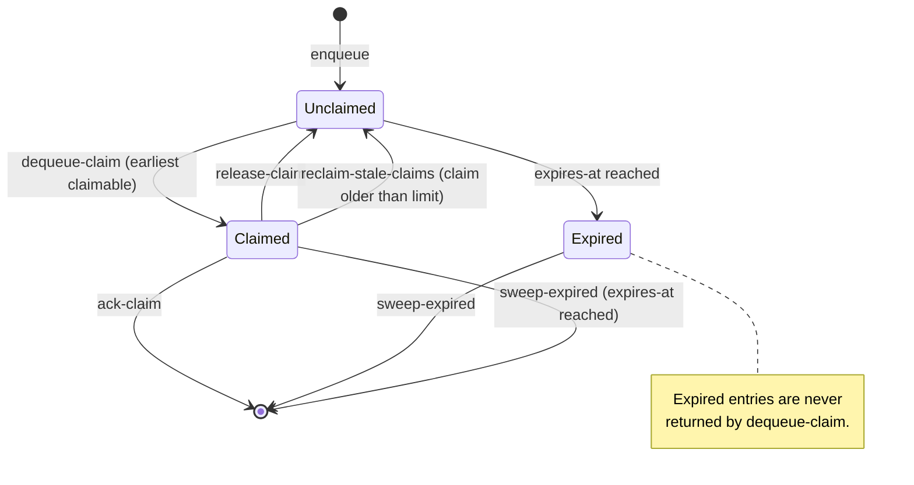
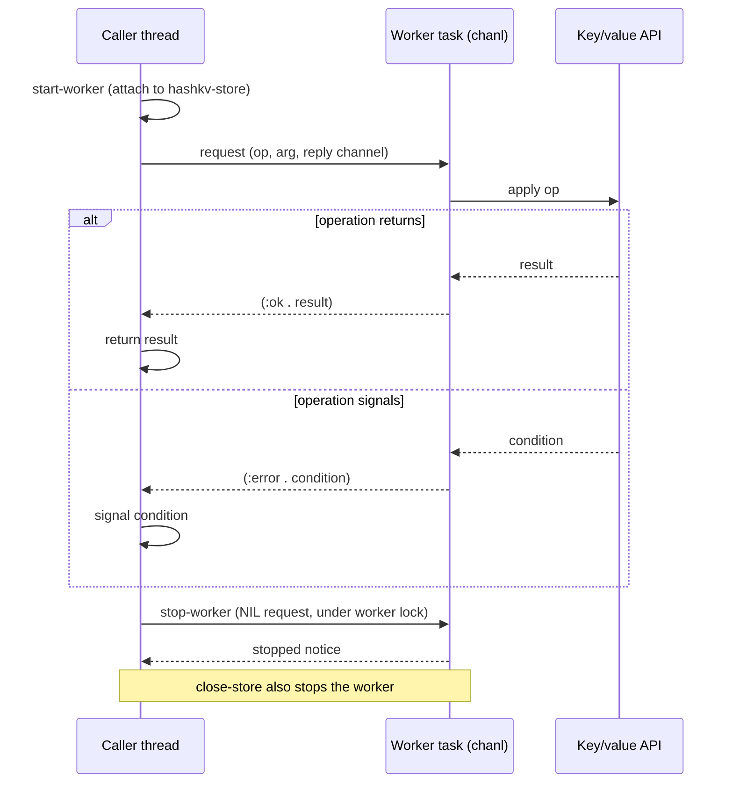

# bknr.hashkv architecture

Diagrams describe version 1.1.0 on the `develop` branch.

## Components

`bknr.hashkv` runs in the caller's process. Every write passes through
a `bknr.datastore` transaction, which the store's guard serialises.

## Key/value write path

The value is converted to its stored form before the transaction: a
fresh copy made only of types the transaction log can write, with class
instances as slot lists. The lookup that decides between creating and
updating an entry runs inside the same transaction as the write. A
concurrent put of the same value therefore finds the entry the first
put created, and no transaction fails on the unique index. Reads return
a copy rebuilt from the stored form.

## Queue entry lifecycle

Order among claimable entries is the store object id, which the store
allocates in transaction order.

## Worker request flow

The worker is attached to the open store. An operation's error is
returned to the caller and signalled there; the worker keeps running.

